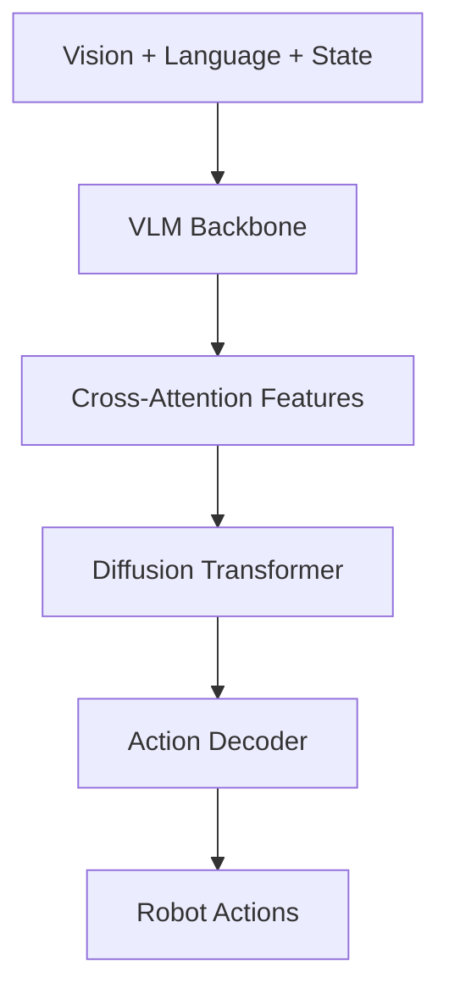

GR00T N1.6 is a vision-language-action (VLA) model that combines a 2B parameter vision-language foundation model with a 32-layer diffusion transformer to generate continuous robot actions.


## Architecture overview

The complete model consists of three main components:



1. **Vision-language backbone**: Processes multimodal observations (images, text, robot state)
2. **Diffusion transformer**: Denoises action trajectories through flow matching
3. **Embodiment projectors**: Encodes/decodes robot-specific states and actions

## Vision-language backbone

The backbone is based on NVIDIA's Cosmos-Reason-2B VLM variant, implemented in the `EagleBackbone` class.

### Key features

<CardGroup cols={2}>
  <Card title="Flexible resolution" icon="expand">
    Processes images in their native aspect ratio without padding
  </Card>
  
  <Card title="Embodied reasoning" icon="brain">
    Pre-trained on next action prediction and embodied tasks
  </Card>
  
  <Card title="Layer selection" icon="layer-group">
    Uses intermediate layers for optimal feature extraction
  </Card>
  
  <Card title="Flash attention" icon="bolt">
    Efficient attention with flash-attention-2 implementation
  </Card>
</CardGroup>

### Implementation

From `gr00t/model/modules/eagle_backbone.py`:

```python
class EagleBackbone(torch.nn.Module):
    def __init__(
        self,
        model_name: str = "nvidia/Eagle-Block2A-2B-v2",
        tune_llm: bool = False,
        tune_visual: bool = False,
        select_layer: int = -1,
        tune_top_llm_layers: int = 0,
        use_flash_attention: bool = False,
        load_bf16: bool = False,
    ):
        # Load pre-trained VLM with flash attention
        extra_kwargs = {}
        if use_flash_attention:
            extra_kwargs["attn_implementation"] = "flash_attention_2"
        if load_bf16:
            extra_kwargs["torch_dtype"] = torch.bfloat16
            
        # Trim layers for efficiency (keep only up to select_layer)
        while len(self.model.language_model.model.layers) > select_layer:
            self.model.language_model.model.layers.pop(-1)
```

### Forward pass

```python
def forward(self, vl_input: BatchFeature) -> BatchFeature:
    keys_to_use = ["input_ids", "attention_mask", "pixel_values"]
    vl_input = {k: vl_input[k] for k in keys_to_use}
    
    # Get hidden states from selected layer
    outputs = self.model(**vl_input, output_hidden_states=True)
    outputs = outputs["hidden_states"][-1]
    
    # Track image token positions
    image_mask = vl_input["input_ids"] == self.model.config.image_token_index
    attention_mask = vl_input["attention_mask"] == 1
    
    return BatchFeature(
        data={
            "backbone_features": outputs,  # [B, seq_len, 2048]
            "backbone_attention_mask": attention_mask,
            "image_mask": image_mask,
        }
    )
```

**Output shape**: `[batch_size, sequence_length, 2048]` where sequence_length includes image tokens and text tokens.

## Action head architecture

The `Gr00tN1d6ActionHead` generates actions through flow matching diffusion, implemented with a 32-layer transformer.

### Components

<Tabs>
  <Tab title="State encoder">
    **CategorySpecificMLP**: Encodes proprioceptive state per embodiment
    
    ```python
    self.state_encoder = CategorySpecificMLP(
        num_categories=config.max_num_embodiments,
        input_dim=config.max_state_dim,
        hidden_dim=self.hidden_size,
        output_dim=self.input_embedding_dim,
    )
    ```
    
    Supports multi-embodiment training with separate weights per robot type.
  </Tab>
  
  <Tab title="Action encoder">
    **MultiEmbodimentActionEncoder**: Embeds noisy action trajectories with timestep conditioning
    
    ```python
    self.action_encoder = MultiEmbodimentActionEncoder(
        action_dim=self.action_dim,
        hidden_size=self.input_embedding_dim,
        num_embodiments=config.max_num_embodiments,
    )
    ```
    
    Uses sinusoidal positional encoding for diffusion timesteps.
  </Tab>
  
  <Tab title="Diffusion model">
    **AlternateVLDiT**: 32-layer transformer with alternating self and cross-attention
    
    ```python
    self.model = AlternateVLDiT(
        **config.diffusion_model_cfg,
        cross_attention_dim=config.backbone_embedding_dim,
        attend_text_every_n_blocks=config.attend_text_every_n_blocks,
    )
    ```
    
    Separates image and text tokens for efficient cross-attention.
  </Tab>
  
  <Tab title="Action decoder">
    **CategorySpecificMLP**: Decodes hidden states to action space per embodiment
    
    ```python
    self.action_decoder = CategorySpecificMLP(
        num_categories=config.max_num_embodiments,
        input_dim=self.hidden_size,
        hidden_dim=self.hidden_size,
        output_dim=self.action_dim,
    )
    ```
    
    Projects DiT outputs to robot-specific action dimensions.
  </Tab>
</Tabs>

## Diffusion transformer (DiT)

The core of the action head is a 32-layer diffusion transformer with cross-attention to VLM features.

### Architecture details

From `gr00t/model/modules/dit.py:172-196`:

```python
class DiT(ModelMixin, ConfigMixin):
    def __init__(
        self,
        num_attention_heads: int = 8,
        attention_head_dim: int = 64,
        output_dim: int = 26,
        num_layers: int = 32,  # N1.6 uses 32 layers (vs 16 in N1.5)
        dropout: float = 0.1,
        norm_type: str = "ada_norm",  # Adaptive layer norm with timestep conditioning
        cross_attention_dim: Optional[int] = None,
    ):
        # Timestep encoder using sinusoidal embeddings
        self.timestep_encoder = TimestepEncoder(
            embedding_dim=self.inner_dim
        )
        
        # 32 transformer blocks with alternating attention patterns
        all_blocks = []
        for idx in range(num_layers):
            all_blocks.append(
                BasicTransformerBlock(
                    self.inner_dim,
                    num_attention_heads,
                    attention_head_dim,
                    cross_attention_dim=cross_attention_dim,
                    norm_type=norm_type,
                )
            )
        self.transformer_blocks = nn.ModuleList(all_blocks)
```

### Transformer block structure

Each `BasicTransformerBlock` contains:

1. **Adaptive layer norm**: Conditioned on diffusion timestep
2. **Cross-attention**: Attends to VLM features (vision + language)
3. **Feed-forward**: MLP with GELU activation
4. **Residual connections**: Skip connections for gradient flow

```python
class BasicTransformerBlock(nn.Module):
    def forward(
        self,
        hidden_states: torch.Tensor,  # [B, T, D] - action embeddings
        encoder_hidden_states: torch.Tensor,  # [B, S, D] - VLM features  
        temb: torch.Tensor,  # [B, D] - timestep embedding
    ) -> torch.Tensor:
        # Adaptive layer norm with timestep conditioning
        norm_hidden_states = self.norm1(hidden_states, temb)
        
        # Cross-attention to VLM features
        attn_output = self.attn1(
            norm_hidden_states,
            encoder_hidden_states=encoder_hidden_states,
        )
        hidden_states = attn_output + hidden_states
        
        # Feed-forward network
        ff_output = self.ff(self.norm3(hidden_states))
        hidden_states = ff_output + hidden_states
        
        return hidden_states
```

### AlternateVLDiT variant

N1.6 uses an enhanced DiT that separates image and text tokens during cross-attention:

```python
class AlternateVLDiT(DiT):
    def forward(
        self,
        hidden_states: torch.Tensor,
        encoder_hidden_states: torch.Tensor,
        image_mask: torch.Tensor,  # Indicates which tokens are images
        backbone_attention_mask: torch.Tensor,
    ):
        # Create separate masks for image and text tokens
        image_attention_mask = image_mask & backbone_attention_mask
        non_image_attention_mask = (~image_mask) & backbone_attention_mask
        
        for idx, block in enumerate(self.transformer_blocks):
            if idx % 2 == 1:
                # Self-attention blocks
                hidden_states = block(hidden_states, encoder_hidden_states=None)
            else:
                # Alternate between text and image cross-attention
                if idx % (2 * self.attend_text_every_n_blocks) == 0:
                    mask = non_image_attention_mask  # Attend to text
                else:
                    mask = image_attention_mask  # Attend to images
                    
                hidden_states = block(
                    hidden_states,
                    encoder_hidden_states=encoder_hidden_states,
                    encoder_attention_mask=mask,
                )
```

<Info>
  Alternating between image and text attention improves efficiency and allows the model to specialize different layers for visual vs. linguistic reasoning.
</Info>

## Flow matching diffusion

GR00T uses flow matching for action generation, a continuous-time diffusion process.

### Training objective

From `gr00t/model/gr00t_n1d6/gr00t_n1d6.py:197-248`:

```python
def forward(self, backbone_output: BatchFeature, action_input: BatchFeature):
    # Sample timestep from beta distribution
    t = self.sample_time(batch_size, device, dtype)
    
    # Create noisy action trajectory
    noise = torch.randn_like(actions)
    noisy_trajectory = (1 - t) * noise + t * actions
    
    # Ground truth velocity field
    velocity = actions - noise
    
    # Encode noisy actions with timestep
    action_features = self.action_encoder(noisy_trajectory, t_discretized, embodiment_id)
    
    # Concatenate with state features
    sa_embs = torch.cat((state_features, action_features), dim=1)
    
    # Forward through DiT
    model_output = self.model(
        hidden_states=sa_embs,
        encoder_hidden_states=vl_embeds,
        timestep=t_discretized,
    )
    
    # Decode to action space
    pred_velocity = self.action_decoder(model_output, embodiment_id)
    
    # MSE loss on velocity field
    action_loss = F.mse_loss(pred_velocity, velocity) * action_mask
    loss = action_loss.sum() / (action_mask.sum() + 1e-6)
```

**Training process:**
1. Sample timestep `t ~ Beta(α, β)` 
2. Interpolate between noise and ground truth: `x_t = (1-t) * noise + t * action`
3. Predict velocity: `v = action - noise`
4. Train model to predict velocity at timestep `t`

### Inference (denoising)

```python
@torch.no_grad()
def get_action(self, backbone_output, action_input):
    # Initialize with random noise
    actions = torch.randn(size=(B, action_horizon, action_dim))
    
    dt = 1.0 / num_inference_timesteps  # e.g., 1/4 = 0.25
    
    # Iterative denoising (default: 4 steps)
    for t in range(num_inference_timesteps):
        t_cont = t / num_inference_timesteps  # 0, 0.25, 0.5, 0.75
        
        # Encode current action estimate
        action_features = self.action_encoder(actions, t_discretized, embodiment_id)
        sa_embs = torch.cat((state_features, action_features), dim=1)
        
        # Predict velocity
        model_output = self.model(sa_embs, vl_embeds, t_discretized)
        pred_velocity = self.action_decoder(model_output, embodiment_id)
        
        # Euler integration: x_{t+1} = x_t + dt * v_t
        actions = actions + dt * pred_velocity
    
    return actions  # Final denoised actions
```

<Note>
  GR00T uses **4 denoising steps** by default, balancing quality and inference speed (16ms action head latency on RTX 5090).
</Note>

## Embodiment-specific projectors

GR00T supports multiple robot embodiments through category-specific linear layers.

### CategorySpecificLinear

From `gr00t/model/modules/embodiment_conditioned_mlp.py:44-64`:

```python
class CategorySpecificLinear(nn.Module):
    def __init__(self, num_categories, input_dim, hidden_dim):
        super().__init__()
        # Separate weights and biases for each embodiment
        self.W = nn.Parameter(0.02 * torch.randn(num_categories, input_dim, hidden_dim))
        self.b = nn.Parameter(torch.zeros(num_categories, hidden_dim))
    
    def forward(self, x, cat_ids):
        # Select weights for each batch item's embodiment
        selected_W = self.W[cat_ids]  # [B, input_dim, hidden_dim]
        selected_b = self.b[cat_ids]  # [B, hidden_dim]
        
        # Batch matrix multiply
        return torch.bmm(x, selected_W) + selected_b.unsqueeze(1)
```

**Example**: With 10 embodiments, a single `CategorySpecificLinear(10, 14, 512)` layer stores 10 separate weight matrices of shape `[14, 512]`.

### Multi-embodiment action encoder

```python
class MultiEmbodimentActionEncoder(nn.Module):
    def __init__(self, action_dim, hidden_size, num_embodiments):
        self.W1 = CategorySpecificLinear(num_embodiments, action_dim, hidden_size)
        self.W2 = CategorySpecificLinear(num_embodiments, 2 * hidden_size, hidden_size)
        self.W3 = CategorySpecificLinear(num_embodiments, hidden_size, hidden_size)
        self.pos_encoding = SinusoidalPositionalEncoding(hidden_size)
    
    def forward(self, actions, timesteps, cat_ids):
        # Embed actions with embodiment-specific projection
        a_emb = self.W1(actions, cat_ids)  # [B, T, hidden_size]
        
        # Add sinusoidal timestep encoding
        tau_emb = self.pos_encoding(timesteps)  # [B, T, hidden_size]
        
        # Combine with embodiment-specific MLPs
        x = torch.cat([a_emb, tau_emb], dim=-1)  # [B, T, 2*hidden_size]
        x = swish(self.W2(x, cat_ids))
        x = self.W3(x, cat_ids)
        
        return x  # [B, T, hidden_size]
```

<Info>
  This architecture allows a single model to handle different robot configurations (7-DOF arms, 14-DOF humanoids, etc.) by learning embodiment-specific projections.
</Info>

## Model configuration

Key hyperparameters for the full architecture:

| Parameter | Value | Description |
|-----------|-------|-------------|
| `backbone_embedding_dim` | 2048 | VLM hidden size |
| `input_embedding_dim` | 512 | Action head embedding size |
| `hidden_size` | 512 | DiT hidden dimension |
| `num_layers` | 32 | DiT transformer layers |
| `num_attention_heads` | 8 | Attention heads per layer |
| `attention_head_dim` | 64 | Dimension per attention head |
| `action_horizon` | 16 | Number of action steps predicted |
| `num_inference_timesteps` | 4 | Denoising steps during inference |
| `max_action_dim` | 32 | Maximum action dimension across embodiments |
| `max_state_dim` | 32 | Maximum state dimension |
| `max_num_embodiments` | 10 | Number of supported robot types |

## Memory and computation

### Model size

<CardGroup cols={2}>
  <Card title="Total parameters" icon="microchip">
    ~3B parameters (2B VLM + 1B action head)
  </Card>
  
  <Card title="GPU memory" icon="memory">
    ~12 GB for inference (bfloat16)
  </Card>
</CardGroup>

### Inference breakdown

On RTX 5090 with torch.compile:

```python
# From README.md inference timing table
Data Processing:  2 ms   # Image preprocessing, tokenization
Backbone:        18 ms   # VLM forward pass  
Action Head:     16 ms   # 4 DiT denoising steps
─────────────────────
End-to-End:      37 ms   # 27.3 Hz throughput
```

### Training configuration

Recommended settings:

```python
# From gr00t/experiment/launch_finetune.py
CUDA_VISIBLE_DEVICES=0 uv run python gr00t/experiment/launch_finetune.py \
    --base-model-path nvidia/GR00T-N1.6-3B \
    --global-batch-size 32 \
    --max-steps 2000 \
    --save-steps 2000 \
    --dataloader-num-workers 4
```

**Memory requirements:**
- 1x H100 (80GB): Batch size 32-64
- 1x L40 (48GB): Batch size 16-32  
- 1x RTX 4090 (24GB): Batch size 8-16

## Summary

The GR00T N1.6 architecture combines:

1. **Foundation model**: 2B parameter VLM with flexible vision encoding
2. **Scalable diffusion**: 32-layer transformer for high-capacity action modeling  
3. **Multi-embodiment**: Category-specific projectors for cross-robot learning
4. **Efficient inference**: 27 Hz throughput with 4-step denoising

This design enables few-shot adaptation to new tasks while maintaining strong zero-shot generalization across diverse robot embodiments.
